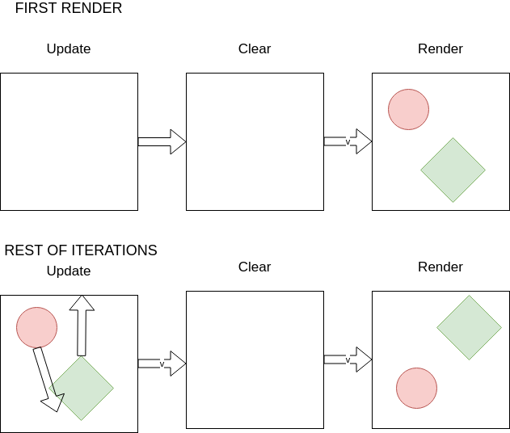

# Animaciones

Aprender a manejar animaciones nos permitirá exprimir todo el potencial de `canvas`, a partir de este punto del libro es donde las cosas se irán poniendo cada vez más interesantes.

En esta sección veremos como utiliar un `loop` o bucle para aplicar movimiento a elementos pintados en un `canvas`. Para la representación de las entidades utilizaremos programación orientada a objetos (OOP) en ES6.

-----

**¿Cómo se origina una animación?**

Los comienzos de la animación se remontan al año 1640, aunque su verdadera difusión comenzó en el siglo XIX cuando se descubrió el principio de persistencia de la visión. Este principio demuestra que el ojo humano es capaz de percibir un movimiento continuo a partir de una sucesión de imágenes si estas se reemplazan lo suficientemente rápido. De esta manera, y como si se tratase de una película, una animación en `canvas` se produce gracias a la transición de los frames en un periodo corto de tiempo.


Por lo tanto, para animar en canvas necesitaremos crear una sucesión de "frames" o estados e ir actualizandolos en el tiempo.
Cada uno de esos frames será la representación visual del estado de nuestras entidades en un determinado momento de tiempo `t`.


Para poder desarrollar estas animaciones deberemos seguir los siguientes pasos:
- Necesitamos actualizar el estado de nuestras entidades: Fase de actualización o `update`
  - Para saber cuanto se tienen que desplazar o actualizar las entidades utilizaremos la diferencia de tiempo desde el momento actual a la animación anterior. Esta diferencia `dt` nos servirá para calcular la distancia que se tiene que mover una entidad, con respecto a su velocidad, u otras propiedades que deban actualizarse a lo largo del tiempo.
- Tenemos que borrar el frame anterior del canvas: Fase de limpieza o `clear`
- Pintaremos el estado actual de las entidades: Fase de pintado o `render`




Una vez pintado un estado de nuestra aplicación, volveremos a ejecutar el mismo flujo de acciones una y otra vez para que se produzca la animación. En pseudo-código quedaría así:

```
antes = obtenFechaActual()

bucle{
  ahora = obtenFechaActual()
  diferencialDeTiempo = ahora - antes
  actualizarEntidades(diferencialDeTiempo)
  borrarCanvas()
  pintarCanvas()
  antes = ahora
  ejecutar bucle dentro de X milisegundos
}
```

## El `loop` o bucle

Cuando se trata de hacer animaciones, necesitamos que la pantalla se repinte (cuantas más veces, mejor) con los nuevos estados de los elementos a lo largo del tiempo.

Si quisieramos que la pantalla se pintase 60 veces por segundo, podríamos suponer que bastaría con realizar un `setTimeOut` con un intervalo de unos 16 milisegundos entre llamada y llamada. (16 milisegundos * 60 es más o menos 1 segundo )

```javascript
var antes = Date.now();

function bucle(){
  var ahora = Date.now();
  var dt = ahora - antes;
  actualizar(dt);
  borrar();
  pintar();

  antes = ahora;
  setTimeout(bucle, 16);
}
```

Si nuestro código fuese eficiente y se ejecutase muy rápido no habría problemas en utilizar `setTimeout`.  Pero el mundo real dista de ser perfecto. Cuando programamos a veces introducimos cálculos costosos o realizamos animaciones que requieren de mucho renderizado, y nuestro navegador no es capaz de calcular todos los nuevos valores y renderizar todo el canvas en 16 milisegundos. Además, aunque funcionase en nuestro dispositivo, no podemos asegurar que vaya a funcionar igual en otros dispositivos con menor o mayor capacidad de procesamiento. 
Si se da el caso de que un usuario tuviese que ejecutar este código con un `setTimeout` a 16 ms en un dispositivo con una capacidad de renderizado menor, lo que sucedería es que se acumularía memoria entre ejecución y ejecución del bucle, hasta llegar a un estado de inestabilidad de la aplicación. 

Aunque JavaScript tenga tiempo suficiente de enviar las instrucciones de renderizado al navegador, necesitamos esperar a que este termine de pintar todos los cambios antes de volver a ejecutar una fase de `actualizado`, `limpieza`, `renderizado`. 

Para ello utilizaremos `requestAnimationFrame`. Un método del navegador que nos permite ejecutar un callback cuando se ha terminado de renderizar la vista del navegador.

>######  Un dato interesante
`requestAnimationFrame` es una función que recibe un callback que será ejecutado antes de repintar la pantalla.
```javascript
window.requestAnimationFrame(callback);
```

De esta manera podemos construir animaciones que funcionaran bien independientemente del dispositivo en el que se ejecuten. Aunque entre ellos habrá diferencia de FPS - frames por segundo - dependiendo de su capacidad de procesamiento y renderizado. En el ejemplo anterior, el dispositivo veloz podrá ejecutar una animación a 60fps mientras que el dispositivo lento quizá esté haciendo que funcione a 30fps, pero en ningún caso se producirá un desbordamiento de memoria.

Veamos un ejemplo de como sería nuestra función de bucle:

```javascript
var antes = Date.now();

function loop(){

  var ahora = Date.now();
  var dt = ahora - antes;
  update(dt);
  clear();
  render();

  antes = ahora;

  requestAnimationFrame(loop);
}
```

## Update

La fase de actualización será la que contenga la lógica referente a la actualiación de estados de cada uno de los elementos del sistema en cada iteración del bucle:

Un ejemplo de cosas que podría llevar a cabo esta función:

- Cambiar el ángulo de renderizado de una figura
- Cambiar su posición x,y a lo largo del tiempo
- Calcular la interacción gravítica entre ella y el resto de partículas
- Cambiar el color de fondo del canvas
- Descontar la vida de un jugador por haber tocado a un enemigo
- Todo lo que se os ocurra.

Por poner un ejemplo, imaginemos una figura que se desplaza a una velocidad determinada a lo largo del tiempo.

El siguiente ejemplo incrementa la posición del `personaje` en el eje X `200` píxeles por cada *frame*.

```javascript
function update(){
  const velocidad = 200;
  personaje.x = personaje.x + velocidad;
}
```


Supongamos que disponemos de un dispositivo que es capaz de alcanzar `60` frames por segundo de renderizado (`60FPS`), este dispositivo desplazará el personaje más veces en un segundo que otro dispositivo que pueda renderizar menos *frames por segundo*. 

Para lidiar con ello, deberemos condicionar todas las actualizaciones al **tiempo delta** o diferencia de tiempo.

El **tiempo delta** es la diferencia de tiempo entre el momento anterior de ejecución y el actual. Ayuda a realizar cálculos condicionados por el tiempo real que ha pasado entre el frame anterior y el actual. De esta manera podemos conseguir que un objeto realice un movimiento a la misma velocidad independientemente de la cantidad de frames que se sucedan en un segundo.


```javascript
let antes = Date.now();

function loop(){
  const ahora = Date.now();
  //dt => deltaTime => tiempo delta
  const dt = ahora - antes; 
  update(dt);
  clear();
  render();

  antes = ahora;

  requestAnimationFrame(loop);
}
```

Veamos un ejemplo;

```javascript
function update(dt){
  const velocidad = 200;
  personaje.x = personaje.x + velocidad * dt;
}
```

El tiempo delta, en un dispositivo que renderize a `60FPS`, será una variable de un valor aproximado a `16.66`, lo que haría que el personaje aumentase su posición en `16.66 * 200`, `3332` píxeles, cada iteración. Para trabajar con unidades más cómodas dividimos el valor del tiempo delta por `1000`.

```javascript
const dt = (ahora - antes) / 1000 // 0,016 aprox
```

Así en cada ejecución del método update el personaje estará desplazandose en el eje x `200 * 0.01666`, `3.33` píxeles, completando en un segundo un desplazamiento de `200` píxeles.

El resultado es un movimiento mucho más fluido:


Más adelante veremos como crear párticulas con movimientos y apariencias más interesantes:


## Renderizado

La fase de renderizado se encarga de pintar todo lo necesario en el canvas, cada uno de los elementos que contengan una representación visual tienen un turno para ser pintado, y es este.


Partamos de la base de que tenemos una clase `Square`, que se encarga de renderizar un cuadrado en el canvas. Este cuadrado será como el que hemos visto en ejercicios del tema 1.

```javascript
class Square() {
  constructor(x, y, width) {
    this.x = x;
    this.y = y;
    this.width = width;
  }

  render(context) {
    //Dibuja un rectangulo azul con borde rojo
    context.save();
    context.translate(this.x, this.y);

    context.beginPath();
    context.rect( - this.width / 2, - this.width / 2, this.width, this.width);

    context.strokeStyle = 'red';
    context.fillStyle = 'blue';
    context.fill();
    context.stroke();

    context.restore();
  }
}

```

La aplicación que orquesta el renderizado de ese cuadrado sería la siguiente:

```javascript
const canvas = document.getElementById('canvas');
const context = canvas.getContext('2d');
let then = Date.now();

//Inicialización del cuadrado
const square = new Square(100, 100, 300);

function update(dt){
  //TODO
}

function render(){
  square.render(context);
}

function loop(){
  const now = Date.now();
  const dt = (now - then) / 1000;

  update(dt);
  render();

  then = now;
  requestAnimationFrame(loop);
}

loop();
```

Veamos como añadiríamos una función de rotación del cuadrado mediante el uso de OOP.

Lo primero será añadir una nueva propiedad que indique el ángulo de rotación del cuadrado.

```javascript
class Square() {
  constructor(x, y, width) {
    this.x = x;
    this.y = y;
    this.width = width;

    //Añadimos una nueva propiedad angle
    this.angle = 0;
  }
}
```

Ahora definiremos una nueva función llamada `rotate`, mediante el prototype de la función `Square`, que actualice el valor de esta propiedad.

```javascript
class Square() {
  /*...*/
  rotate(angle) {
    this.angle = angle
  }
}
```

Y utilizaremos ese ángulo en el renderizado, **fijate en el uso de context.save() y context.restore()** para aislar el estado del canvas y devolver el punto inicial de coordenadas a su estado original después del pintado.

```javascript
class Square() {
  /*...*/
  render(context) {
    //Guardamos el contexto
    context.save();

    //Pasamos el ángulo a radianes
    const radians = Utils.degreeToRadian(this.angle);
    
    //Ponemos el eje de coordenadas en el centro del cuadarado para rotar correctamente
    context.translate(this.x + this.width / 2, this.y + this.width / 2);

    //Realizamos la rotación del contexto en radianes
    context.rotate(radians);

    //Dibuja un rectangulo azul con borde rojo
    context.beginPath();
    context.rect( - this.width / 2, - this.width / 2, this.width, this.width);
    context.strokeStyle = 'red';
    context.fillStyle = 'blue';
    context.fill();
    context.stroke();
    
    //Restauramos el contexto
    context.restore();
  }
}
```

De esta manera, cualquier instancia del objeto `Square` expondrá un nuevo método `rotate`, añadiremos entonces la invocación a ese método en el método `update` que es el encargado de realizar las actualizaciones de estados:

```javascript
const canvas = document.getElementById('canvas');
const context = canvas.getContext('2d');
let then = Date.now();

//Inicialización del cuadrado
const square = new Square(100, 100, 300);

function update(dt){
  square.rotate(14);
}

function render()
  square.render(context);
}

function loop(){
  const now = Date.now();
  const dt = (now - then) / 1000;

  update(dt);
  render();

  then = now;
  requestAnimationFrame(loop);
}

loop();
```


### Dinamismo

Hagamos uso de nuestros nuevos conocimientos y creemos nuestra primera animación trabajando con los conceptos de **`loop`** y **`update`**.

Partiendo del último ejemplo que acabamos de ver, modificamos la clase `Square` que tenga un método `update` que se encargue de encapsular la lógica de actualización del cuadrado.

```javascript
class Square() {
  /* ... */
  update(dt) {
    /*
      Incrementamos el ángulo a lo largo del tiempo, multiplicando la velocidad
      de rotación por el diferencial de tiempo
    */
    this.angle += this.speed  * dt
  }
}
```

En este caso hemos decidido incrementar el ángulo de rotación del cuadrado, para ello hemos multiplicado la *velocidad de rotación* del objeto por el *tiempo delta*.

Finalmente, quedando nuestro código fuente de la siguiente manera:

### app.js


```javascript
const canvas = document.getElementById('canvas');
const context = canvas.getContext('2d');

//Inicialización de las variables
let now = then = Date.now();
const square = new Square(100, 100, 300);

//Actualizamos nuestros elementos
function update(dt){
  square.update(dt);
}

//Renderizado de los elementos
function render(){
  square.render(context);
}

//Ciclo
function loop(){
  now = Date.now();
  //Calcula el diferencial de tiempo entre esta ejecución y la anterior
  const dt = (now - then) / 1000;
  update(dt);
  render();

  //Almacenamos el valor que de now para la siguiente iteración
  then = now;
  requestAnimationFrame(loop);
}

loop();

```

### square.js

```javascript
class Square {
  constructor(x, y, width) {
    this.x = x;
    this.y = y;
    this.width = width;
    this.angle = 0;
    
    const turnsPerSecond = 8;
    this.speed = turnsPerSecond * 2 * Math.PI;
  }

  rotate(angle) {
    this.angle = angle;
  }

  render(context) {
    const radians = Utils.degreeToRadian(this.angle);
    //Guardamos el estado del canvas
    context.save();

    //Le decimos al canvas que vamos a pintar líneas
    context.beginPath();

    context.translate(this.x + this.width / 2, this.y + this.width / 2);
    context.rotate(radians);

    //Dibuja un rectangulo azul con borde rojo
    context.rect( - this.width / 2, - this.width / 2, this.width, this.width);
    context.strokeStyle = 'red';
    context.fillStyle = 'blue';
    context.fill();
    context.stroke();

    //Restauramos el estado del canvas
    context.restore();
  }

  update(dt) {
    this.angle += this.speed * dt;
  }
}

```

### Resultado

¡Sí! El cuadrado se mueve, gira y gira hasta crear un círculo.


**¿Por qué se muestra así?**

Estamos viendo lo que sucede cuando todos los frames se mantienen uno encima de otro. Quedan apilados, y al final se acaba dibujando un círculo, debido a la rotación del cuadrado.

Para que veamos _un cuadrado rotando_ debemos limpiar el canvas entre pintado y pintado.

## Limpiando el canvas

Añadiremos una nueva funcion en nuestro bucle llamada `clear` que limpiará el canvas, dejandolo blanco y reluciente.

```javascript

function loop(){
  now = Date.now();
  //Calcula el diferencial de tiempo entre esta ejecución y la anterior
  const dt = (now - then) / 1000;
  
  update(dt);
  clear();
  render();

  //Almacenamos el valor que de now para la siguiente iteración
  then = now;
  requestAnimationFrame(loop);
}

function clear(){
  context.clearRect(0, 0, canvas.width, canvas.height);
}
```

Existen varios métodos de limpiar el canvas, el bueno, el feo y el malo.


1) **El Bueno**: Utilizando clearRect

`context.clearRect()` permite borrar un rectángulo del contexto. Deberás tener en mente utilizar `context.beginPath();` antes de pintar tus figuras, de otra manera canvas no tiene constancia de que existe algo que borrar.

```javascript
//Recibe (coordenada_x, coordenada_y, anchura, altura) y lo borra del canvas
context.clearRect(0, 0, canvas.width, canvas.height);
```


2) **El Feo**: Repintando todo el canvas con `fillRect` o `fill`

```javascript
context.fillStyle = 'white';
context.fillRect(0, 0, canvas.width, canvas.height);
//O alternativamente
context.rect(0, 0, canvas.width, canvas.height);
context.fill();
```

Tiene la desventaja de que añadimos más carga de pintado entre frame y frame.

3) **El malo**: Cambiando el tamaño del canvas.

```javascript
canvas.width = canvas.width;
```

Canviar las dimensiones del canvas produce un borrado de lo que este contiene. Aunque añade una carga de consumo de recursos que deberíamos evitar si es posible.

**Usaremos el bueno, siempre que podamos**

### Et voilà! Habemus animación


Hemos alcanzado un punto en el que nuestra aplicación es más fácil de escalar, de momento, hasta nuevos límites.

___Para realizar animaciones / aplicaciones que solo tengan una pantalla tendriamos más que suficiente con esta estructuración. Si se tratase de un juego con niveles y fases, sería recomendable abstraerlo un poco más.___


**Ejercicio 1**

Crea un círculo situado en `100, 100` que rote con respecto al punto `300, 300`.

*Ayuda*

````javascript
//Translamos el origen de coordenadas para hacer una rotación
context.save();
context.translate(300, 300);
context.rotate(radians);
context.restore();
````


**Ejercicio 2**

Pinta un rectángulo en la posición `0, 0` y haz que su posición se incremente en cada ejecución del método update hasta llegar a `canvas.width, canvas.height`.

**Ejercicio 3**

Cuando el cuadrado llege a la posición `x === canvas.width` o `y === canvas.height` invierte el valor de la velocidad.


**Ejercicio 4**

Crea 4 círculos, cada uno de un tamaño distinto, como los de la siguiente imagen:


Cada uno de los círculos tendrá las siguientes propiedades:
  - Distancia al centro aleatoria entre 0 y 200
  - Velocidad de movimiento aleatoria entre 0.0001 y 0.001
  - Ángulo inicial aleatorio entre 0º y 360º
  - Color aleatorio
  - Radio aleatorio

Todos los círculos rotarán con respecto al centro del canvas, pero desplazados la distancia indicada.

*Ayuda*

Create una nueva clase llamada `Circle`.

Encapsula la inicialización de los objetos en una función `start` que será la primera en ser ejecutada:

```javascript
const circles = [];

/* ... */

function start(){

  canvas.width = window.innerWidth;
  canvas.height = window.innerHeight;

  for (let i = 0; i < 4; i ++){
    shapes.push(new Circle({
      distance : Utils.randomInteger(0, 200),
      radius : Utils.randomInteger(10, 50),
      speed : Utils.randomInteger(1, 100),
      angle : Utils.randomInteger(0, 360),
      color : colors[i]
    }))
  }

  loop();
}

```

Estos son los colores utilizados en la imagen.

```javascript
const bgColor = '#1CA692';
const colors = ['#F1EBD5', '#FBBC16', '#FF820E', '#FF3352'];
```


