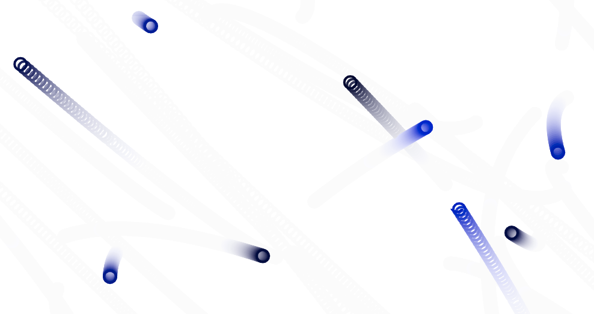

#  Motor de renderizado

*Código fuente: https://github.com/rafinskipg/introductioncanvas/blob/master/examples/lib/Engine.js*

Una de las características de los programadores es que intentamos buscar siempre la optimización de los procesos repetitivos, minimizando de esta manera el esfuerzo necesario para producir el mismo resultado.

Recordemos el ejemplo de código necesario para orquestar una animación en canvas:

```javascript
const canvas = document.getElementById('canvas');
const context = canvas.getContext('2d');

let now = then = Date.now();
const square = new Square(100, 100, 300);

function update(dt) {
  square.update(dt);
}

function render() {
  square.render(context);
}

function clear() {
  // Store the current transformation matrix
  context.save();

  // Use the identity matrix while clearing the canvas
  context.setTransform(1, 0, 0, 1, 0, 0);
  context.clearRect(0, 0, canvas.width, canvas.height);

  // Restore the transform
  context.restore();
}

function loop() {
  now = Date.now();
  //Calcula el diferencial de tiempo entre esta ejecución y la anterior
  const dt = (now - then) / 1000;

  update(dt);
  clear();
  render();

  //Almacenamos el valor que de now para la siguiente iteración
  then = now;
  requestAnimationFrame(loop);
}

loop();
```

La mayor parte del código son las estructuras necesarias para invocar las funciones del bucle una y otra vez. Sin embargo, la lógica de la aplicación es relativamente pequeña.

Si vamos a realizar más ejercicios sería conveniente no tener que duplicar una y otra vez la función `loop`, para ello vamos a crear un pequeño _motor_ de renderizado que reutilizaremos de aquí en adelante.

## Requisitos

Necesitaremos, para una primera versión, que este motor nos permita orquestar animaciones usando, al menos, un canvas. Será necesario:
- Que permita definir métodos para cada una de las fases update/render
- Que acepte uno o varios callback de inicialización
- Que permita crear tanto dibujos animados como no animados (sin llamadas recursivas a `loop`).
- Que tenga un método para inicializarlo.

En futuras mejoras podremos añadir:
- Que acepte uno o varios callback de limpieza del canvas
- Que se pueda indicar un máximo de iteraciones a ejecutar
- Que se pueda indicar un tiempo de espera antes de que empiece la animacion
- Que tenga un método de pausado/continuación de la animación
- Que se pueda alterar un modificador de la variable `dt` en el método de `update` de tal manera que la velocidad de la animación cambie.

Miremos el problema de arriba hacia abajo. Necesitamos inicializar un `Engine`. Para ello podríamos abordarlo de distintas maneras, seguramente se nos ocurran muchas ideas sobre como resolverlo, a continuación he expuesto algunas de ellas:

**Opción A - Parámetros en el constructor**

Permitimos pasar parámetros a un constructor, como el ID del elemento HTML canvas o las fases update/render.

```javascript
/*
  function update(){
    ...
  }
  function render(){
    render
  }
 */
const engine = new Engine({
  canvasId :'canvas',
  update : update,
  render : render
});

engine.start();
```

**Opción B - Añadiendo callbacks**

Permitimos añadir callbacks a las fases.

```javascript
/*
  function update(){
    ...
  }
  function render(){
    render
  }
 */
const engine = new Engine(canvas);
engine.addUpdateCallback(update);
engine.addRenderCallback(render);

engine.start();
```

**Opción C - Sin instancia**

```javascript
/*
  function update(){
    ...
  }
  function render(){
    render
  }
 */
Engine.addUpdateCallback(update);
Engine.addRenderCallback(render);

Engine.start();
```

En mi opinión personal, me decanto por utilizar una instancia, ya que permite controlar el estado para cada instancia en vez de utilizar un objeto global. Además prefiero también el método de añadir callbacks en vez de pasarselos en el constructor, ya que permite arquitecturizar tus soluciones de otra manera más flexible, permitiendo suscribir en cualquier momento a un objeto nuevo al ciclo de actualización/renderizado.

Podríamos, sin embargo, tomar una opción mixta. Inicializar el motor con unos valores por defecto y poder añadir más hooks a cada fase posteriormente.

La forma en la que tendría que quedar una refactorización del código anterior  usando nuestro `Engine` podría ser así:

```javascript
const canvas = document.getElementById('canvas');

const square = new Square(100, 100, 300);

//Inicializamos el motor
const myEngine = new Engine(canvas);

myEngine.addUpdateCallback(square.update);
myEngine.addRenderCallback(square.render);

//Empezamos la animacion
myEngine.start();
```

## Implementación

Vamos a ver un ejemplo de como podríamos haber solventado este caso de uso.

Esta implementación no es otra que la que ha emergido de la refactorización de varios de mis ejercicios con canvas. Podéis realizar la vuestra propia según se adapte a vuestras necesidades.

Para proyectos más ambiciosos, como un juego, podéis utilizar otros motores o librerías ya existentes como PixiJS, o crear el vuestro propio, pero recordad que deberéis manejar, no solo el ciclo, si no también el concepto de "stages" o "niveles", etc.


```javascript
//lib/Engine.js
class Engine {
  constructor(canvas, loopable) {
    this.canvas = canvas;
    this.context = canvas.getContext('2d');
    //Almacenarán los callbacks de cada una fase del ciclo
    this.renderCbs = [];
    this.updateCbs = [];
    this.startCbs = [];

    this.now = Date.now();
    this.then = Date.now();
    
    //Podemos decidir si se ejecutará más de una vez o solo una vez el ciclo
    this.loopable = (typeof(loopable) === 'undefined' || loopable !== false) ? true : false;
  }


  addRenderCallback(cb){
    this.renderCbs.push(cb);
  }

  addUpdateCallback(cb){
    this.updateCbs.push(cb);
  }

  addStartCallback(cb){
    this.startCbs.push(cb);
  }

  //Llama a cada uno de los callbacks de renderizado
  render() {
    this.renderCbs.forEach((cb) =>
      cb(this.context, this.canvas);
    });
  };

  //Llama a cada uno de los callbacks de actualización
  update(dt){
    this.updateCbs.forEach((cb) =>
      cb(dt, this.context, this.canvas)
    });
  }

  //Llimpieza del canvas
  clear(){
    // Guarda la matriz de transformación actual
    this.context.save();

    // Usa la matriz de identidad para limpiar el canvas
    this.context.setTransform(1, 0, 0, 1, 0, 0);
    this.context.clearRect(0, 0, this.canvas.width, this.canvas.height);

    // Restaura la transformación
    this.context.restore();
  }

  loop(){
    this.now = Date.now();
    //Calcula el diferencial de tiempo entre esta ejecución y la anterior
    var dt = (this.now - this.then) / 1000;
    
    this.update(dt);
    this.clear();
    this.render();

    //Almacenamos el valor que de now para la siguiente iteración
    this.then = this.now;

    if(this.loopable){
      requestAnimationFrame(() => this.loop());
    }
  }

  //Llama a cada uno de los callbacks de inicialización
  start(){
    this.startCbs.forEach((cb) => 
      cb(this.context, this.canvas)
    });

    this.loop();
  }
}
```

_Si te has fijado, en las fases de `update` y `render ` se está utilizando `Array.prototype.forEach`, sin embargo este método no es el más eficiente. Sería más eficiente utilizar un clásico bucle `for`:_

```javascript
update(dt){
  var maxItems = this.updateCbs.length;
  for(var i = 0; i < maxItems; i++){
    this.updateCbs[i](dt, this.context, this.canvas);
  }
}
```


>De aquí en adelante **todos los ejemplos utilizarán `Engine` para orquestar el renderizado**. Sin embargo la decisión de crear este Engine es por agilidad a la hora de reescribir los ejercicios, evitando tener que utilizar el `loop` en cada ejemplo, añadiendo un poco de azúcar sintáctico. Pero la decisión final de utilizarlo depende en cada caso del lector, sin duda alguna. 

Vamos a añadir ahora un par de cosas más que serán útiles. 

## Definir un método de limpieza custom

```javascript
// Engine.js
setClearingMethod(cb) {
  this.clearingMethod = cb;
};

clear() {

  if (this.hasOwnProperty('clearingMethod')) {
    this.clearingMethod(this.context, this.canvas);
  } else {
    // Store the current transformation matrix
    this.context.save();

    // Use the identity matrix while clearing the canvas
    this.context.setTransform(1, 0, 0, 1, 0, 0);
    this.context.clearRect(0, 0, this.canvas.width, this.canvas.height);

    // Restore the transform
    this.context.restore();
  }
}
```

De esta manera tendremos la capacidad de definir nuestros propios métodos de limpiado del canvas.
Esto es útil si queremos delegar la limpieza del canvas a cada una de las entidades: a veces la performance puede mejorar si cada entidad decide borrarse a si misma antes de repintarse, en vez de borrar todo el canvas.
También puede servir para crear otros efectos. Por ejemplo, podemos dejar el estado anterior semitransparente y mostrar el nuevo encima.

```javascript
function clear(context, canvas) {
  //Pinta un rectángulo semi transparente dando una sensación de que el estado anterior se va difuminando
  context.fillStyle = "rgba(255, 255, 255, 0.10)";
  context.fillRect(0, 0, canvas.width, canvas.height);
}

const myEngine = new Engine(canvas);
myEngine.setClearingMethod(clear);
```




## Aceptar un máximo de ciclos

Sería útil disponer de un `Engine` capaz de pararse tras ejecutar N ciclos, para poder tomar capturas de pantalla o hacer animaciones cortas. Esto nos puede servir en un futuro para hacer arte generativo y guardar frames del proceso. 

Añadiremos el parámetro `maxIterations` a la inicialización e iremos incrementando una variable `currentIteration` tras cada ejecución del ciclo. Una vez se alcance la iteración máxima dejaremos de llamar al ciclo.

```javascript
constructor(canvas, loopable, maxIterations) {
  this.canvas = canvas;
  this.context = canvas.getContext('2d');

  this.renderCbs = [];
  this.updateCbs = [];
  this.startCbs = [];

  //Nueva propiedad maxIterations
  this.maxIterations = maxIterations || null;
  this.currentIteration = 0;

  this.now = Date.now();
  this.then = Date.now();

  this.loopable = (typeof(loopable) === 'undefined' || loopable !== false) ? true : false;
}

loop (){
  this.now = Date.now();
  var dt = (this.now - this.then) / 1000;
  
  this.update(dt);
  this.clear();
  this.render();
  //Incrementamos la iteracion
  this.currentIteration++;

  this.then = this.now;

  //Ejecutamos el ciclo otra vez si es loopable y si no hay restricción de iteraciones
  if ((this.loopable
     && this.hasOwnProperty('maxIterations') === false) 
     || (this.hasOwnProperty('maxIterations') && this.currentIteration <= this.maxIterations)) {
    requestAnimationFrame(() => this.loop());
  }
}
```

Un ejemplo de uso de esta nueva funcionalidad del engine:

```javascript
//El motor se parará tras 100 ciclos
const myEngine = new Engine(canvas, true, 100);
```


Como ya he comentado la decisión de utilizarlo, extenderlo, refactorizarlo y adaptarlo recae en tus manos. Si no estás conforme con la implementación del `Engine` eres libre de crear el tuyo propio o utilizar un bucle simple para orquestar los renderizados. Lo prioritario es que podamos optimizar el proceso para centrarnos en la parte realmente importante, la modificación de las entidades. :)

Podrás obtener una versión más completa del `Engine` en la carpeta `lib` de ejercicios del libro.