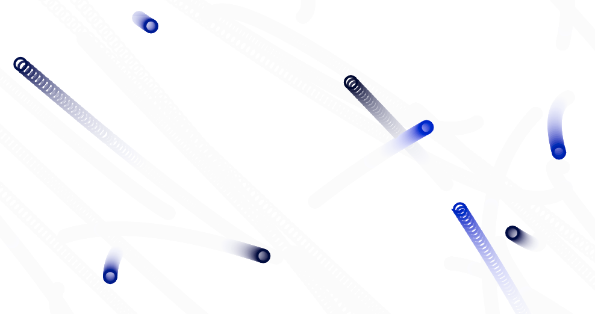

# Partículas

Imaginemos el siguiente escenario en el que varias partículas se mueven con movimientos rectilíneos uniformes (sin aceleración), en distintas direcciónes y con distintas velocidades.


```javascript
class Particle {
  constructor(options) {
    this.x = options.x;
    this.y = options.y;
    this.speedX = options.speedX;
    this.speedY = options.speedY;
  }

  update(dt){
    this.x = this.x + (this.speedX * dt);
    this.y = this.y + (this.speedY * dt);
  }

  render(context) {
    context.beginPath();
    context.arc(this.x, this.y, 10, 0, 2 * Math.PI);
    context.lineWidth = 4;
    context.stroke();
  }
}
```

Siguiendo el proceso mental que nos llevó a crear los ejemplos anteriores podríamos deducir que una implementación de este escenario sería algo así:

```javascript
//App.js
const canvas = document.getElementById('canvas');
let particles = [];
const NUM_PARTICLES = 200;

function update(dt){
  for(let i = 0; i < particles.length; i++){
    particles[i].update(dt);
  }
}

function render(context){
  for(let i = 0; i < particles.length; i++){
    particles[i].render(context);
  }
}

function start(){
  canvas.width = window.innerWidth;
  canvas.height = window.innerHeight;
  
  for (let i = 0; i < NUM_PARTICLES; i++) {
    const posX = Utils.randomInteger(0, canvas.width);
    const posY = Utils.randomInteger(0, canvas.height);
    const speedX = Utils.randomFloat(-100, 100);
    const speedY = Utils.randomFloat(-100, 100);
    
    particles.push(new Particle({
      x: posX,
      y: posY,
      speedX: speedX,
      speedY: speedY
    }));
  }
}

const myEngine = new Engine(canvas);
myEngine.addStartCallback(start);
myEngine.addUpdateCallback(update);
myEngine.addRenderCallback(render);
myEngine.start();
```


**Condición: Volatilidad**

Los comportamientos que añaden nuevas condiciones pueden complicar el código rápidamente. 

Añadamos al ejemplo anterior una condición: 

- Cada partícula tendrá un `combustible` que irá consumiendo a medida que se mueva, cuando ese combustible se termine la partícula deberá desaparecer de la lista de partículas.

```javascript
class Particle {
  constructor (options) {
    this.x = options.x;
    this.y = options.y;
    this.speedX = options.speedX;
    this.speedY = options.speedY;
    this.combustible = options.combustible;
  }

  update(dt){
    this.combustible -= 1;
    this.x = this.x + (this.speedX * dt);
    this.y = this.y + (this.speedY * dt);
  }
}
```

Una posible implementación del método `update` en `App.js`:

```javascript
function update(dt){
  var remainingParticles = [];
  for(var i = 0; i < particles.length; i++){
    particles[i].update(dt);
    if(particle.combustible >= 0){
      remainingParticles.push(particle);
    }
  }
  particles = remainingParticles;
}
```

Vamos a refactorizar la función update utilizando algunos de los métodos de Array: `Array.prototype.forEach`, `Array.prototype.map` y `Array.prototype.filter`.

`map` acepta una función como parámetro que será ejecutada sobre cada elemento de la colección y devolverá una colección de elementos retornados en esas funciones.

Por ejemplo:

```javascript
var nums = [1,2,3];

var results = nums.map(function(num){
  return num * 2;
});

console.log(results);
// [2,4,6]
```

`filter` nos permite reducir la colección a una lista filtrada.

```javascript
var nums = [1,2,3];

// Quitar todos los números que sean ===2
var results = nums
  .map(num => num * 2)
  .filter(num => num !== 2);

console.log(results);
// [4, 6]
```

`forEach` permite iterar sobre cada elemento de un array para ejecutar un callback, aunque no devuelve una nueva lista.

En este caso vamos a usar `forEach` y `filter` para refactorizar el método de update.

```javascript
function update(dt) {
  particles.forEach(p => p.update(dt))
  particles = particles
    .filter(p => p.combustible > 0)   
}
```

Como se puede apreciar en la siguiente imagen, varias partículas han desaparecido al agotarse su combustible.


## Ejercicio 1

- Asocia la cantidad de combustible restante en una partícula al tamaño de la misma.
- Cambia el color de fondo del canvas.

## Ejercicio 2
- Renderiza las partículas con combustible utilizando un gradiente `context.createRadialGradient`.
- Añade a cada partícula una sombra.


# Aplicando aceleración.

Vamos a añadir dos nueva reglas:
- cuando una partícula muera aparecerá una nueva en una posición aleatoria
- las partículas aparecerán con una aceleración aleatoria

Primero abstraeremos la lógica para poder crear una nueva partícula en un método:

```javascript

function createParticle() {
  const posX = Utils.randomInteger(0, canvas.width);
  const posY = Utils.randomInteger(0, canvas.height);
  const combustible = Utils.randomInteger(100, 200);
  const speedX = Utils.randomFloat(-100, 100);
  const speedY = Utils.randomFloat(-100, 100);
  // Añadimos acc
  const acc = Utils.randomFloat(-4, 4);
  
  return new Particle({
    x: posX,
    y: posY,
    combustible : combustible,
    speedX: speedX,
    speedY: speedY,
    acc: acc
  });
}
```

Si queremos añadir una partícula cuando otra muera, deberemos hacerlo en la fase de `update`. Cuando buscamos las partículas sin combustible, devolveremos una nueva en el caso de encontrar una que acaba de agotarse.

```javascript
function update(dt) {
  particles.forEach(p => p.update(dt))
  particles = particles
    .map(p => {
      if (p.combustible <= 0) {
        return createParticle()
      } else {
        return p
      }
    })   
}
```

Para poder utilizar la aceleración en cada partícula tendremos que tenerla en cuenta y sumar su valor a la velocidad:

```javascript
update(dt){
  this.combustible -= 1;
  // Añadimos la aceleración a la velocidad X e Y
  this.speedX = this.speedX + this.acc
  this.speedY = this.speedY + this.acc
  this.x = this.x + (this.speedX * dt);
  this.y = this.y + (this.speedY * dt);
}
```



Vemos que empiezan a aparecer movimientos con curvas, debido a que las partículas tienen una velocidad inicial pero pueden tener aceleraciones que apuntan en otra dirección:


Aún así estamos utilizando una misma aceleración para dos velocidades diferentes, la velocidad en el ejeX y la velocidad en el ejeY. Podemos cambiar la implementacion y crear `accX` y `accY` para aplicar el cambio sobre `speedX` y `speedY`.

```javascript
update(dt){
  this.combustible -= 1;
  // Añadimos la aceleración a la velocidad X e Y
  this.speedX = this.speedX + this.accX
  this.speedY = this.speedY + this.accY
  this.x = this.x + (this.speedX * dt);
  this.y = this.y + (this.speedY * dt);
}
```
En el siguiente capítulo veremos como utilizar **vectores** para poder simplificar el cálculo de velocidad, aceleración y fuerzas cuando existen más variables a tener en cuenta.

