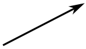
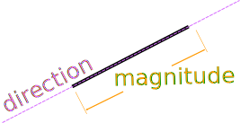
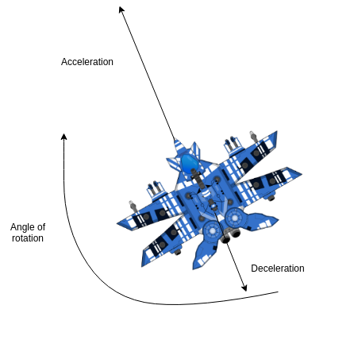
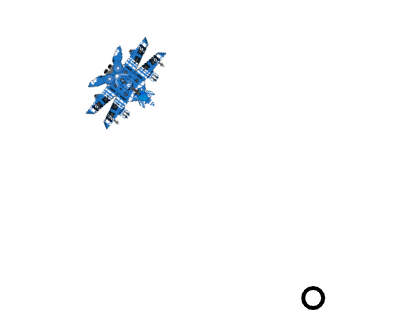
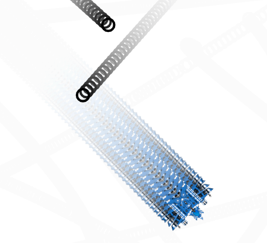

# Vectores

## ¿Qué es un Vector? 


En física, un vector es un ente matemático como la recta o el plano. Un vector se representa mediante un segmento de recta, orientado dentro del espacio euclidiano tridimensional.

Un vector tiene tres propiedades independientes: magnitud, dirección y sentido.



Los vectores pueden ser representados graficamente en 2 o 3 dimensiones. Se llama vector de dimensión `N` a una tupla de `N` números reales. 

Los vectores que vamos a utilizar en estos ejemplos van a ser de 2 dimensiones. Un ejemplo de una representación de un vector podría ser `[0, 0]`.

Algunos ejemplos de vectores en la naturaleza son la velocidad, el momento, la fuerza, los campos electromagnéticos y el peso. Una cantidad o fenómeno que exhiba solamente una magnitud, sin una dirección específica, se llama vector escalar. Ejemplos de vectores escalares son la velocidad, la masa o la resistencia eléctrica.

----

En este capítulo vamos a utilizar una librería para vectores de 2 dimensiones y veremos como implementar una simulación de la gravedad.

Una librería para Vector2D es una herramienta para facilitar los cálculos con vectores de 2 dimensiones. Un vector de dos dimensiones no es más que un objeto con 2 coordenadas, por ejemplo las coordenadas de posición o los valores de velocidad:


Un vector de 2 dimensiones es un objeto con 2 propiedades que representan esas dimensiones. Sirven para representar posiciones y velocidades. Además los vectores tienen una dirección y una magnitud.

Imaginemos un objeto que tiene un vector para representar su velocidad `(3, 5)`, podemos calcular la velocidad total del objeto, o la magnitud del vector, utilizando el teorema de pitágoras.

El teorema de pitágoras dice que el cuadrado de la hipotenusa de un triángulo rectángulo es igual a la suma de los cuadrados de los catetos. En este caso los catetos seran `velocidadX` y `velocidadY`. 

```
hipotenusa^2 = velocidadX^2 + velocidadY^2
```


>El teorema de pitágoras nos sirve para calcular la magnitud de cualquier vector de 2 dimensiones

Trasladado a JavaScript:

```javascript
var vector = {
  x : 3,
  y : 5
};
var velocidadRectangulo = Math.sqrt(vector.x * vector.x + vector.y * vector.y )
==> 5.830951894845301
```

Una vez hemos obtenido la magnitud de un vector, podemos **normalizarlo**. Normalizar un vector significa convertirlo en un **vector unitario** - cuya longitud es 1 - pero manteniendo la misma dirección del vector original.

Para transformar un vector a un vector unitario solo hace falta dividir el vector por su magnitud. Por ejemplo, el **vector unitario** de `(3,5)` podría calcularse de la siguiente manera:

```javascript
var vector = {
  x : 3,
  y : 5
};
var magnitud = Math.sqrt(vector.x * vector.x + vector.y * vector.y );

var unitario = {
  x : vector.x / magnitud,
  y : vector.y / magnitud
}
//==> Object {x: 0.5144957554275265, y: 0.8574929257125441}
```

## ¿Cómo nos puede ayudar utilizar una librería de vectores?

Hasta ahora cuando teníamos una entidad que se movía por el plano de 2 dimensiones utilizabamos una velocidad X y otra velocidad Y, además si queríamos utilizar la aceleración teníamos que mantener también 2 valores.

```javascript
{
  speedX: 1.1,
  speedY: 0.4,
  accX: 0.3,
  accY: 0.4
}

// Update
this.speedX = this.speedX + this.accX
this.speedY = this.speedY + this.accY
```

Con una librería de vectores podemos simplifiar los cálculos:

```javascript
{
  speed: Vector(1.1, 0.4),
  acc: Vector(0.3, 0.4)
}

// Update
this.speed = this.speed.add(this.acc)
```


## VictorJS


Existen múltiples implementaciones de librerías Vector2D y generalmente todos los motores de creación de Juegos o animaciones suelen llevar la suya propia o reutilizan alguna librería opensource.

Hemos elegido la librería VictorJS, esta librería nos provee de utilidades para realizar operaciones matemáticas. Nos facilitará trabajar con velocidades, posiciones y ángulos a la hora de mover nuestros elementos por el canvas.

Primero vamos a instalar las librerías que necesitaremos. Dependerá del gestor de paquetes que utilices. Si no conoces ningún gestor de paquetes, a día de hoy (2020) el principal gestor de paquetes para JavaScript es NPM. Anteriormente también se utilizaba bastante Bower. Aunque sin duda la opcion más sencilla para estos ejercicios es descargar el código fuente o utilizar un CDN. 

Si no quieres utilizar VictorJS, puedes implementar tu propia librería de vectores o utilizar otra alternativa. Nuestro único objetivo es poder simplificar los cálculos matemáticos para poder centrarnos en las representaciones visuales.


**Instalando con NPM**
```
npm install victor --save
```

El siguiente ejemplo funcionaría en NodeJS. Si quisieramos que funcionara en una web tendriamos que utilizar un bundler como Webpack o Parcel. 

```javascript
var Victor = require('victor');
var vec = new Victor(42, 1337);
```

Si necesitas ayuda instalando Node o configurando Parcel puedes dirigirte al la web de "FromZeroToCanvas" donde encontraras guías actualizadas y ejemplos enviados por la comunidad.


**Instalando con Bower**
```
bower install --save lodash
bower install --save victor
```

Luego las referenciaremos en el archivo index.html

```html
<script src="../../../bower_components/victor/build/victor.min.js"></script>
<script src="../../lib/utils.js"></script>
<script src="../../lib/Engine.js"></script>
```

Podemos instanciar un nuevo vector de la siguiente manera:

```javascript
var vec = new Victor(42, 1337);
vec.x
// => 42
vec.y
// => 1337
```

Se puede utilizar el método `clone` si no deseamos alterar el objeto inicial al realizar una adición de vectores.

```javascript
var vec = new Victor(100, 200);

vec
  .clone()
  .add(new Victor(50, 50))
  .toString();
// => x: 150, y: 250

vec.toString();
// => x: 100, y: 200
```


>######  Un dato interesante
Otros métodos de la API de Victor que podremos necesitar son `vector.substract`, `vector.divide`, `vector.limit`, `vector.multiply`... 
Puedes encontrar más información sobre los métodos disponibles en su documentación online. 

Puedes encontrar más información sobre la API de VictorJS en : 
 - https//github.com/maxkueng/victor


## Nuestra entidad base

Crearemos una entidad base llamada `BaseEntity`, de la que luego heredaremos para crear todas las demás entidades.

Trasladaremos las implementaciones de posición, velocidad y aceleración a la sintáxis de la librería de Vector2D.

```javascript
//BaseEntity.js
class BaseEntity {
  constructor(opts){
    // Vector de posición
    this.pos = new Victor(opts.x, opts.y);
    // Vector de velocidad
    this.speed = new Victor(opts.speedX || 0, opts.speedY || 0);
    // Vector de aceleración
    this.acceleration = new Victor(opts.accX || 0, opts.accY || 0);
  }

  update(dt){
    // Añadimos la aceleración a la velocidad
    this.speed.add(this.acceleration);

    // Calculamos el diferencial de posición 
    const posDt = this.speed.clone().multiply(new Victor(dt, dt));

    // Añadimos la diferencia de posición a la posición actual
    this.pos = this.pos.add(posDt);
  }

  render(context, canvas){
    // Implementar
  }
}
```

Podríamos reimplementar nuestra partícula del capítulo anterior de la siguiente forma:

```javascript
class Particle extends BaseEntity {
  constructor(opts) {
    super(opts)
    this.combustible = opts.combustible
  }

  update(dt) {
    super.update(dt)
    this.combustible -= 1;
  }

  render(context) {
    context.beginPath();
    context.arc(this.pos.x, this.pos.y, 10, 0, 2 * Math.PI);
    context.lineWidth = 4;
    context.stroke();
  }
}
```

Para ello tendremos que importar la librería de vectores y la entidad base.

```html
<script src="../../lib/utils.js"></script>
<script src="../../lib/Engine.js"></script>
<script src="../../../bower_components/victor/build/victor.min.js"></script>
<script src="models/BaseEntity.js"></script>
<script src="models/particle.js"></script>
<script src="app.js"></script>
```

Esto nos servirá para poder trabajar de forma más eficiente. Si queremos crear alguna animación solo tendremos que traernos nuestro `Engine`, nuestra libería de vectores y la entidad base y podremos programar rápidamente.

## Añadiendo un jugador y refactorizando el código

En el ejercicio anterior teníamos una serie de partículas moviendose por la pantalla

Ahora vamos a crear un jugador que obtenga puntos cada vez que colisione con un partícula. Este jugador aparecerá en una posición inicial y podrá desplazarse en cuatro direcciones con el uso del teclado.

```javascript
const player = new Player({
  x: 0,
  y: 0,
})
```



Este jugador tomará forma de nave espacial. Cuando presionemos las teclas ARROW_LEFT y ARROW_RIGHT la nave va a rotar a izquierda y derecha. Y cuando presionemos ARROW_UP o ARROW_DOWN la nave acelerará o decelerará su velocidad. 

Primero necesitaremos cargar la imagen de la nave:

```javascript
//Preload the image
img.src = 'images/starship.png';
img.onload = function() {
  myEngine.start();
};
```

Al igual que hicimos anteriormente cuando estudiabamos la aceleración, necesitaremos capturar el input del teclado con `document.addEventlistener`.

```javascript
const keysPushed = {}

document.addEventListener('keydown', function(e) {
  e.preventDefault();
  keysPushed[e.key] = true
});

document.addEventListener('keyup', function(e) {
  e.preventDefault();
  keysPushed[e.key] = false
});

```

En el método update miraremos que teclas estan siendo pulsadas y haremos que la nave reaccione a esos input

```javascript

function update(dt) {
  particles.forEach(p => p.update(dt))
  particles = particles
    .map(p => {
      if (p.combustible <= 0) {
        return createParticle()
      } else {
        return p
      }
    })   
  
  if(keysPushed['ArrowUp']) {
    player.accelerate(0.2)
  } else if(keysPushed['ArrowDown']) {
    player.decelerate(0.02)
  } else {
    player.stopAccelerating()
  }

  if(keysPushed['ArrowLeft']) {
    player.rotate(2)
  }

  if(keysPushed['ArrowRight']) {
    player.rotate(-2)
  }

  player.update(dt)
}
```

Ahora solo nos faltará implementar los métodos `rotate`, `accelerate` y `update` en el jugador.
Supongamos que partimos de esta clase `Player` que renderiza la imagen.

```javascript
class Player extends BaseEntity {
  constructor(opts) {
    super(opts)
    this.img = opts.img
  }

  render(context) {
    context.drawImage(this.img, this.pos.x, this.pos.y, 150, 150);
  }
}
```

Añadimos el método rotate. Recuerda, como vimos en capítulos anteriores, antes de hacer una rotación vamos a trasladar el origen de coordenadas, luego rotaremos y por último restauraremos el estado del canvas:

```javascript
class Player extends BaseEntity {
  constructor(opts) {
    super(opts)
    this.img = opts.img

    // Guardamos el ángulo de rotación
    this.angle = 0
  }

  render(context) {
    context.save()
    context.translate(this.pos.x, this.pos.y)
    context.rotate(Utils.degreeToRadian(this.angle))

    // Ahora pintamos la imagen en -75, -75 para que el eje de rotación sea el centro de la imagen.
    context.drawImage(this.img, -75, -75, 150, 150);
    context.restore()
  }

  rotate(deg) {
    this.angle = this.angle + deg
  }
}
```



Lo siguiente que querremos animar es el movimiento de la nave hacia adelante. Vamos a implementar el método accelerate.

```javascript
accelerate(val) { 
  const newAcc = new Victor(val, val)
  this.acceleration.add(newAcc.rotateByDeg(this.angle))
}
```
Estamos llamando a `rotateByDeg` antes de añadir la nueva aceleración a la aceleración actual. Cuando rotamos un vector ciertos grados, en este caso porque la nave está orientada hacia otra dirección, los valores `x` e `y` cambian, aunque la magnitud del vector se mantiene.

Tenemos que rotar la aceleración antes de añadirla para poder tener en cuenta la dirección en la que acelera la nave.

Similarmente, el método decelerate tendría que rotar el vector de aceleración antes de restarlo.

```javascript
decelerate(val) {
  const newAcc = new Victor(val, val)
  this.acceleration.subtract(newAcc.rotateByDeg(this.angle))
}
```




Así de sencillo. Ya tenemos movimiento de nuestra nave. Pero ahora tenemos un problema, la nave sale de la pantalla y el jugador no puede volver a localizarla. 

Lo que haremos será incluir un método en la clase `BaseEntity` llamado `checkLimits` que nos indicará si la instancia esta fuera de unos límites determinados, y si es así la desplazará. Utilizaremos este método para resetear la posición de la nave y que reaparezca en el canvas.


```javascript
checkLimits(xMin, xMax, yMin, yMax) {
  if (this.pos.x > xMax) {
    this.pos.x = xMin;
  } else if (this.pos.x < xMin) {
    this.pos.x = xMax;
  }

  if (this.pos.y > yMax) {
    this.pos.y = yMin;
  } else if (this.pos.y < yMin) {
    this.pos.y = yMax;
  }
}
```

Este es el código que orquesta nuestra aplicación ahora mismo. 

```javascript
const canvas = document.getElementById('canvas');
const keysPushed = {}
let particles = [];
const spaceshipImage = new Image();

// Declare the new player object
const player = new Player({
  x: 200,
  y: 200,
  img: spaceshipImage
})

const NUM_PARTICLES = 20;

function createParticle() {
  const posX = Utils.randomInteger(0, canvas.width);
  const posY = Utils.randomInteger(0, canvas.height);
  const combustible = Utils.randomInteger(100, 500);
  const speedX = Utils.randomFloat(-100, 100);
  const speedY = Utils.randomFloat(-100, 100);
  const accX = Utils.randomFloat(-4, 4);
  const accY = Utils.randomFloat(-4, 4);

  return new Particle({
    x: posX,
    y: posY,
    combustible : combustible,
    speedX: speedX,
    speedY: speedY,
    accX: accX,
    accY: accY
  });
}

function update(dt) {
  particles.forEach(p => p.update(dt))
  particles = particles
    .map(p => {
      if (p.combustible <= 0) {
        return createParticle()
      } else {
        return p
      }
    })   
  
  if(keysPushed['ArrowUp']) {
    player.accelerate(0.02)
  } else if (keysPushed['ArrowDown']) {
    player.decelerate(0.02)
  } else {
    player.stopAccelerating()
  }

  if(keysPushed['ArrowLeft']) {
    player.rotate(2)
  }

  if(keysPushed['ArrowRight']) {
    player.rotate(-2)
  }

  player.update(dt)

  player.checkLimits(0, canvas.width, 0, canvas.height)
}

function render(context) {
  particles.forEach(function(particle) {
    particle.render(context)
  })

  player.render(context)
}

function start() {
  canvas.width = window.innerWidth;
  canvas.height = window.innerHeight;

  for (let i = 0; i < NUM_PARTICLES; i++) {  
    particles.push(createParticle());
  }
}

document.addEventListener('keydown', function(e) {
  e.preventDefault();
  keysPushed[e.key] = true
});

document.addEventListener('keyup', function(e) {
  e.preventDefault();
  keysPushed[e.key] = false
});


const myEngine = new Engine(canvas);
myEngine.addStartCallback(start);
myEngine.addUpdateCallback(update);
myEngine.addRenderCallback(render);

spaceshipImage.src = 'spaceship.png';
spaceshipImage.onload = function() {
  myEngine.start();
};
```

Como hemos empezado a utilizar vectores podemos refactorizar las propiedades que reciben los constructores de las clases, eliminando `x` e `y` y dejando solamente un vector. Haremos lo mismo con las propiedades de velocidad y aceleración.

```javascript

function createParticle() {
  const pos = new Victor(Utils.randomInteger(0, canvas.width), Utils.randomInteger(0, canvas.height))
  const speed = new Victor(Utils.randomFloat(-100, 100), Utils.randomFloat(-100, 100))
  const acc = new Victor(Utils.randomFloat(-4, 4), Utils.randomFloat(-4, 4))
  const combustible = Utils.randomInteger(100, 500);

  return new Particle({
    combustible,
    pos,
    speed,
    acc
  });
}
```

Los siguientes pasos que podríamos implementar serían:
- Que la nave dispare bombas de energía
- Que las partículas desaparezcan al contacto con una bomba de energía
- Mantener un sistema de puntos


Podrás encontrar los ejemplos completos en la web que acompaña a este libro. 