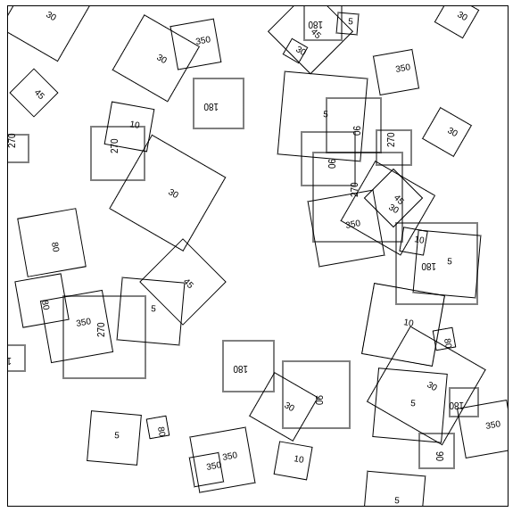

# Rotaciones (`context.rotate`, `context.translate`, `context.save`, `context.restore`)

Hasta ahora solo hemos visto como dibujar figuras sencillas pero a menudo nos vamos a encontrar con casos en los que queremos desplazar estas figuras o rotarlas. 


## Rotate

El método rotate recibe un parámetro, que es el ángulo en radianes. Toda acción posterior a una rotación del contexto se verá afactada por esta rotación. Es decir: si rotamos el contexto todo lo que pintemos será afectado, hasta que lo restauremos.

Para realizar transformaciones entre grados y radianes - y viceversa -, usaremos las siguientes fórmulas. 

```javascript
//lib/Utils.js
var Utils = {};

Utils.radianToDegree  = function(radians){
  return radians * (180/Math.PI)
}

Utils.degreeToRadian = function(degree){
  return degree/(180/Math.PI);
}
```


>######  Un dato interesante
El archivo `lib/utils.js` incluirá todas las fórmulas que se declaren con la sintáxis `Utils.nombreFuncion`

Veamos un ejemplo de como aplicar el método rotate para rotar el cuadrado del primer ejercicio 45 grados.

```javascript
//app.js
var canvas = document.getElementById('canvas');
var context = canvas.getContext('2d');

function render(){
  var radians = Utils.degreeToRadian(45);
  context.rotate(radians);

  //Dibuja un rectangulo azul con borde rojo
  context.rect(100, 100, 300, 300);
  context.strokeStyle = 'red';
  context.fillStyle = 'blue';
  context.fill();
  context.stroke();
}

render();

```


### ¿Por qué se muestra de esta manera ? - El origen de coordenadas.

** Cuando aplicamos una rotación del contexto, estamos rotando sobre el origen de coordenadas del mismo.** En este caso el origen es (0,0) asi que al rotar estamos desplazando todo el canvas desde la esquina superior izquierda. 


_increible manejo de Gimp_

Si queremos rotar el canvas justo en el centro del cuadrado, debemos usar `context.translate` para reposicionar el origen de coordenadas en ese punto.


El método *translate* sirve para cambiar el origen de coordenadas y recibe dos parámetros: `x` e `y`. Una vez ejecutado este método el nuevo "[0, 0]" será el valor indicado. 


```javascript
context.translate(xCord, yCord);
```

Por ejemplo: Si ejecutamos `context.translate(15, 15)`  y posteriormente un `context.rect(0, 0, 10, 10)` estaremos dibujando un cuadrado de 10 pixels de ancho en la coordenada `15, 15`. Aunque el método `context.rect` recibe `0,0` como parámetros de coordenadas, el cambio de origen ejecutado por `translate` hace que se pinte en esas otras coordenadas `15,15`.

Sin contar con la rotación podemos ver un ejemplo de `context.translate` a continuación.

```javascript
//app.js
var canvas = document.getElementById('canvas');
var context = canvas.getContext('2d');

function render(){
  //250, 250 es la coordenada del centro del rectangulo
  context.translate(250, 250);

  
  //Dibuja un rectangulo azul con borde rojo
  context.rect(-150, -150, 300, 300);
  context.strokeStyle = 'red';
  context.fillStyle = 'blue';
  context.fill();
  context.stroke();

  //Dibuja un circulo en el origen de coordenadas, para que veamos cual es
  context.beginPath();
  context.arc(0,0,5,0,2*Math.PI);
  context.fillStyle = 'yellow';
  context.fill();
}

render();

```


- Añadiendo la rotación

```javascript
//app.js
var canvas = document.getElementById('canvas');
var context = canvas.getContext('2d');

function render(){
  var radians = Utils.degreeToRadian(45);

  //250, 250 es la coordenada del centro del rectangulo
  context.translate(250, 250);
  context.rotate(radians);
  
  //Dibuja un rectangulo azul con borde rojo
  context.rect(-150, -150, 300, 300);
  context.strokeStyle = 'red';
  context.fillStyle = 'blue';
  context.fill();
  context.stroke();

  //Dibuja un circulo en el origen de coordenadas, para que veamos cual es
  context.beginPath();
  context.arc(0,0,5,0,2*Math.PI);
  context.fillStyle = 'yellow';
  context.fill();
}

render();
```


## Añadiendo múltiples figuras con diferentes rotaciones.

Pongamos el ejemplo de que queremos crear múltiples cuadrados diferentes, cada uno con una rotación aleatoria, además pintaremos en cada cuadrado un texto con la rotación actual para verificar que se ha rotado como se esperaba. 


Podemos escribir texto en el canvas con `context.fillText`, para más información sobre este método puedes dirigirte al capítulo de texto. 

```javascript
context.fillText('TEXTO', x, y);
```

Dado un número de cuadrados o figuras y una lista de ángulos de rotación disponibles, generar de forma aleatoria esas figuras.
 
```javascript
const totalFigures = 50
const availableAngles = [5, 10, 30, 45, 80, 90, 180, 270, 350]
```

Primero necesitaremos una función que pinte un cuadrado:

```javascript

function drawSquare(x, y, size, angleOfRotation) {
  // Obtenemos los radianes de un ángulo
  const radians = Utils.degreeToRadian(angleOfRotation);

  // Movemos el origen de coordenadas
  context.translate(x, y);

  // Rotamos el contexto esos radianes
  context.rotate(radians);
  
  // Pintamos el cuadrado
  context.beginPath();
  context.rect(-Math.round(size/2), -Math.round(size/2), size, size);
  context.stroke();

  // Ponemos el texto con los grados rotados (en 0, 0 porque hemos usado translate anteriormente)
  context.fillText(angleOfRotation, 0 , 0 );
}
```

Si queremos pintar sólo un cuadrado utilizaríamos este método de la siguiente manera:

```javascript
function render() {
  drawSquare(100, 100, 50, 90)
}
```


Para crear múltiples cuadrados declararemos una función que inicialice todas las variables primero y para hacer más sencillo nuestro código crearemos un par de utilidades:

```javascript
// Devuelve un elemento aleatorio de un array
Utils.randomFromArray = function(items) {
  return items[Math.floor(Math.random() * items.length)]
}

// Devuelve un número aleatorio entre el mínimo y el máximo
Utils.randomInteger = function(min, max) {
  return Math.floor(Math.random() * (max - min + 1)) + min;
}
```

Esta sería nuestra función de renderizado: 

```javascript

function createFigures() {
  for(var i = 0; i<totalFigures; i++) {
    figures.push({
      x: Utils.randomInteger(0, 560),
      y: Utils.randomInteger(0, 560),
      size: Utils.randomInteger(20, 100),
      angle: Utils.randomFromArray(availableAngles)
    })
  }
}


function render() {
  createFigures()

  figures.map(square => {
    drawSquare(square.x, square.y, square.size, square.angle)
  })
}
```


**¿Qué está pasando?**

Al parecer el contexto se está rotando y desplazando demasiado. Esto sucede porque cada vez que invocamos `context.translate` y `context.rotate` ¡lo estamos haciendo sobre las translaciones y rotaciones previamente ejecutadas!.

Esto significa que si primero rotamos el contexto 30 grados para dibujar un cuadrado rotado 30 grados, y posteriormente queremos dibujar una figura rotada 15 grados estaremos pintando una figura rotada 45 grados. 

Para evitar esta acumulación de cambios lo que haremos será utilizar `context.save` y `context.restore`.

`context.save` sirve para guardar un estado del contexto.

> El estado del dibujo que se almacena en una pila consiste en los siguientes elementos:
> La matriz de transformación actual.
> La región de recorte actual.
> La lista de punteado actual.
> Los valores actuales de los siguientes atributos: strokeStyle, fillStyle, globalAlpha, lineWidth, lineCap, lineJoin, miterLimit, lineDashOffset, shadowOffsetX, shadowOffsetY, shadowBlur, shadowColor, globalCompositeOperation, font, textAlign, textBaseline, direction, imageSmoothingEnabled.


Lo que tendremos que hacer será usar el método save() para guardar el estado por defecto y el método restore() para restaurarlo luego, de tal manera que luego se puede dibujar el segundo rectángulo con el estado por defecto.

Podemos incluir esas dos llamadas a save y restore en la creación de nuestro cuadrado: 

```javascript

function drawSquare(x, y, size, angleOfRotation) {
  // Guarda el estado actual en la pila
  context.save()

  // Obtenemos los radianes de un ángulo
  const radians = Utils.degreeToRadian(angleOfRotation);

  // Movemos el origen de coordenadas
  context.translate(x, y);

  // Rotamos el contexto esos radianes
  context.rotate(radians);
  
  // Pintamos el cuadrado
  context.beginPath();
  context.rect(-Math.round(size/2), -Math.round(size/2), size, size);
  context.stroke();

  // Ponemos el texto con los grados rotados (en 0, 0 porque hemos usado translate anteriormente)
  context.fillText(angleOfRotation, 0 , 0 );

  // Volvemos al estado del dibujo anterior
  context.restore()
}
```

Y ahora, poniendo todo junto

```javascript
/**
 * Many rotated figures
 */
const canvas = document.getElementById('canvas');
const context = canvas.getContext('2d');

const totalFigures = 50
const availableAngles = [5, 10, 30, 45, 80, 90, 180, 270, 350]


const figures = []

function drawSquare(x, y, size, angleOfRotation) {
  // Guarda el estado actual en la pila
  context.save()

  // Obtenemos los radianes de un ángulo
  const radians = Utils.degreeToRadian(angleOfRotation);

  // Movemos el origen de coordenadas
  context.translate(x, y);

  // Rotamos el contexto esos radianes
  context.rotate(radians);
  
  // Pintamos el cuadrado
  context.beginPath();
  context.rect(-Math.round(size/2), -Math.round(size/2), size, size);
  context.stroke();

  // Ponemos el texto con los grados rotados (en 0, 0 porque hemos usado translate anteriormente)
  context.fillText(angleOfRotation, 0 , 0 );

  // Volvemos al estado del dibujo anterior
  context.restore()
}

function createFigures() {
  for(var i = 0; i<totalFigures; i++) {
    figures.push({
      x: Utils.randomInteger(0, 560),
      y: Utils.randomInteger(0, 560),
      size: Utils.randomInteger(20, 100),
      angle: Utils.randomFromArray(availableAngles)
    })
  }
}


function render() {
  createFigures()

  figures.map(square => {
    drawSquare(square.x, square.y, square.size, square.angle)
  })
}

render();

```


