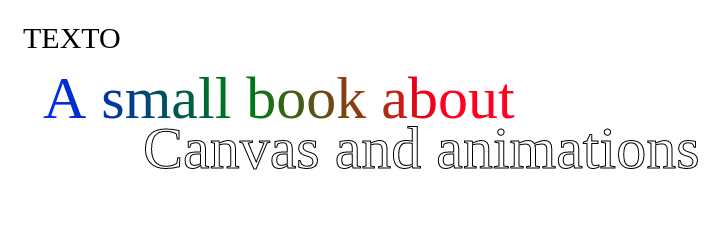

# Manejo de texto (`context.font`, `context.fillText`, `context.measureText`, `context.textAlign`)

Canvas permite introducir texto, aunque a diferencia de HTML el texto introducido no es responsivo (no se adapta a diferentes tamaños automáticamente). 

Para escribir en canvas necesitaremos hacer lo siguiente:

```javascript
context.font = '12px Georgia';
context.fillText('TEXTO', x, y);
```

Escribir en canvas es bastante sencillo, pero tiene algunas carencias con respecto a escribir en un documento HTML, ya que el texto no se ajusta, hay que calcular sus dimensiones. 

```javascript
var size = context.measureText('TEXTO');
var textWidth = size.width;
var textHeight = size.height;
```


## Usando fuentes externas

Para poder reutilizar otras fuentes diferentes podemos precargarlas mediante css.

Para el siguiente ejemplo hemos elegido la fuente **"Mom'sTypewriter"**, una fuente 100% gratuita obtenida de **www.dafont.com**.


```css
@font-face {
    font-family: 'MomsTypeWriter';
    src: url('/fonts/moms.ttf');
    font-weight: normal;
    font-style: normal;
}
```


```javascript
context.font = '30px MomsTypeWriter';
context.fillText('TEXTO', x, y);
```


Cuando ejecutamos el método `fillText` estaremos pintando texto con el estilo indicado en `context.fillStyle`. Como hemos visto en capítulos anteriores este `fillStyle` puede ser un color o un gradiente:

```javascript
  // Definimos un gradiente
  context.font = '60px park';
  var dimensions = context.measureText('A small book about')

  // utilizamos "measureText" para saber donde debe acabar el gradiente
  var gradient = context.createLinearGradient(100, 150, dimensions.width, 30);
  gradient.addColorStop(0, "blue");
  gradient.addColorStop(0.5, "green");
  gradient.addColorStop(1, "red");
  context.fillStyle = gradient;
  
  context.fillText('A small book about', 100, 100);
  context.restore();
```


Si en vez de utilizar fill utilizamos `strokeText` el estilo que se utilizará es el definido en `strokeStyle`. Por defecto es negro, veamos el ejemplo completo incluyendo un texto con `context.strokeText('Canvas and animations', 400, 300);`


```javascript

function render() {
  // Hacemos que el canvas ocupe la pantalla completa
  canvas.width = window.innerWidth;
  canvas.height = window.innerHeight;

  // Texto simple
  context.font = '30px MomsTypeWriter';
  context.fillText('TEXTO', 80, 80);

  // Definimos un gradiente
  context.font = '60px park';
  var dimensions = context.measureText('A small book about')
  var gradient = context.createLinearGradient(100, 150, dimensions.width, 30);
  gradient.addColorStop(0, "blue");
  gradient.addColorStop(0.5, "green");
  gradient.addColorStop(1, "red");
  context.fillStyle = gradient;
  
  // Rellenamos el texto
  context.fillText('A small book about', 100, 150);


  //Dibujamos el titulo, centrado y con stroke. textAlign indica donde se sitúa el cursor de la posición X e Y, si en el centro del texto o a la izquierda o derecha
  context.textAlign = 'center';
  context.font = '60px park';
  context.strokeText('Canvas and animations', 400, 300);

}
```

